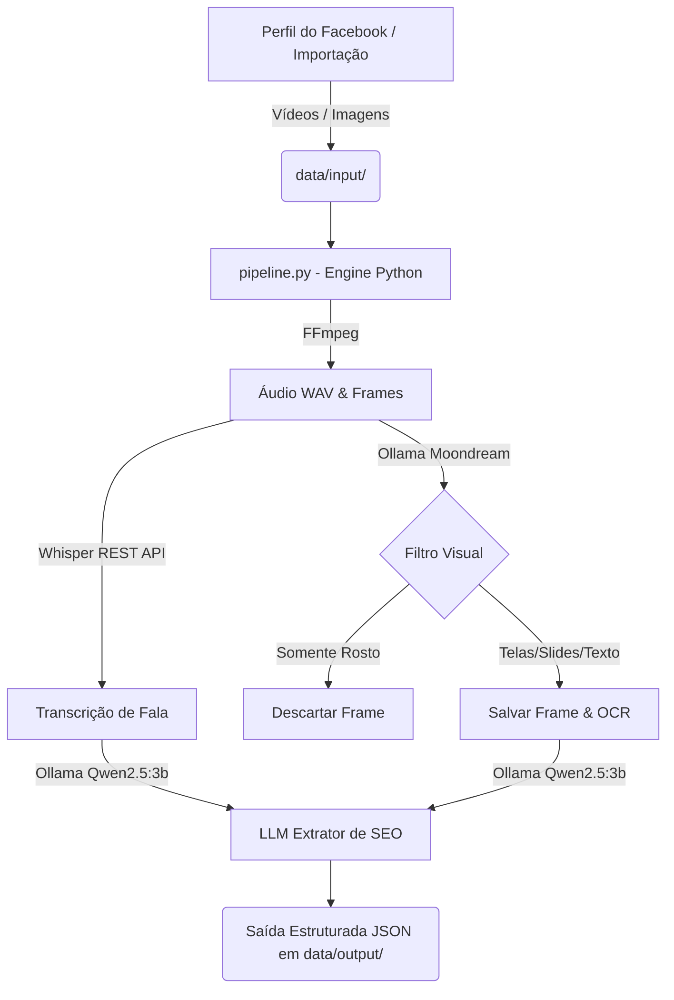

# 🧠 PipelineFace — Extração de Conhecimento de Perfil Facebook

Pipeline local em **Python Nativo** para extrair conhecimento estruturado em SEO (transcrições, análise visual, tutorial passo a passo e termos chave) a partir de vídeos e imagens de perfis do Facebook, utilizando modelos de IA locais (Whisper, Moondream e Qwen2.5:3b).

---

## 📋 Visão Geral

O PipelineFace automatiza a coleta e a extração de conhecimento a partir de posts e vídeos do Facebook:
1. **Scraper (Playwright + yt-dlp):** Coleta mídias de perfis configurados.
2. **Pipeline Python (`pipeline.py`):**
   - **Extração de Mídia:** Separa o áudio via FFmpeg e extrai frames temporais.
   - **Transcrição de Áudio:** Transcreve a fala com o Whisper ASR.
   - **Visão & Filtro Inteligente:** Usa `moondream` para descrever telas de sistemas, slides e buscas no Google. **Filtra e descarta automaticamente frames que contêm apenas o apresentador (*talking head*)**.
   - **Extração de SEO:** Utiliza o `qwen2.5:3b` para estruturar um tutorial passo a passo e conhecimento em SEO.
   - **Saída Estruturada:** Grava documentos `.json` e salva quadros de conteúdo em `data/output/`.

---

## 🏗️ Arquitetura do Sistema



---

## 🚀 Como Executar

### 1. Iniciar os Serviços Básicos (Scraper & Whisper)
```bash
podman-compose up -d
```

### 2. Coletar Mídias do Facebook (Opcional)
```bash
# Login interativo (primeira vez)
./scripts/scrape.sh --target https://www.facebook.com/perfil.alvo --login

# Execuções subsequentes
./scripts/scrape.sh --target https://www.facebook.com/perfil.alvo --only-videos
```

### 3. Executar o Pipeline de Conhecimento em Python
```bash
# Executar uma vez sobre todos os arquivos pendentes em data/input/
python3 pipeline.py

# Ou executar em modo contínuo (monitora novos arquivos a cada 30s):
python3 pipeline.py --watch --interval 30
```

---

## 📊 Formato de Saída (JSON)

Os arquivos finais são salvos em `data/output/<baseName>.json`:

```json
{
  "metadata": {
    "source": "facebook_profile_seo",
    "pipeline_version": "3.0.0 (Python Nativo)",
    "processed_at": "2026-07-25T18:00:00.000Z"
  },
  "source_file": {
    "filename": "Vídeo_exemplo.mp4",
    "type": "video",
    "extension": ".mp4",
    "path": "/data/input/videos/Vídeo_exemplo.mp4",
    "duration_seconds": 73
  },
  "content": {
    "transcription": "Em prompt que te diz exatamente qual sapato focar...",
    "visual_description": "Tela demonstrando busca no Google Trends...",
    "saved_frame_files": [
      "/data/output/frames/Vídeo_exemplo/frame_0003.jpg"
    ]
  },
  "seo_knowledge": {
    "titulo_estrategia": "Como Focar o SEO em um E-Commerce",
    "resumo_executivo": "Determine a categoria e termos focais para SEO...",
    "passo_a_passo_detalhado": [
      "Passo 1: Acesse o Google Trends...",
      "Passo 2: Clique em Explorar..."
    ],
    "ferramentas_e_telas_utilizadas": ["Google Trends", "Gemini"],
    "termos_e_exemplos_usados": ["sapato feminino confortável"],
    "aplicacao_no_negocio": "Utilize os termos focais para criar conteúdo relevante..."
  }
}
```

---

## 🔍 Diagnostics & Checagens

- `./scripts/check-status.sh` - Exibe status dos containers, API Ollama local e contagem de arquivos pendentes/processados.
