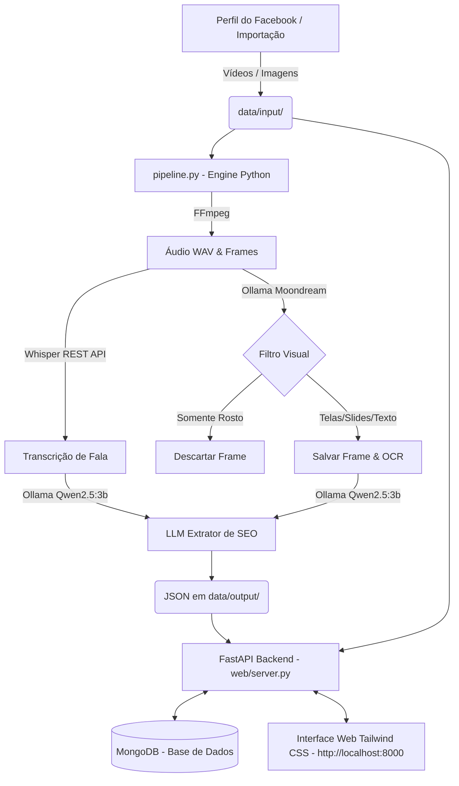

# 🧠 PipelineFace — Gestor de Conhecimento SEO (Tailwind CSS + MongoDB)

Aplicação Web e Pipeline local em **Python Nativo + MongoDB** para extrair, visualizar, gerenciar e implementar estratégias de SEO extraídas de perfis do Facebook.

---

## 📋 Visão Geral & Recursos da Interface Web

A plataforma oferece uma interface rica desenvolvida com **Tailwind CSS (Dark Mode / Glassmorphism)** conectada ao **MongoDB**:

1. **Reprodutor de Mídias de Entrada:**
   - Player de vídeo HTML5 integrado com streaming HTTP Range para assistir ao vídeo original de entrada (`data/input/videos/`).
   - Visualizador de alta resolução para imagens originais (`data/input/images/`).
2. **Galeria de Frames & Telas Extraídas:**
   - Exibição em carrossel/grid dos quadros chave contendo telas do sistema, gráficos de SEO, buscas do Google e slides salvos pelo Ollama Vision (`data/output/frames/`).
3. **Checklist Interativo de Implementação:**
   - Cada passo do tutorial de SEO gerado possui uma caixa de seleção. O progresso (ex: `3/5 passos`) e o status (*Pendente*, *Em Andamento*, *Concluído*) são salvos no MongoDB em tempo real.
4. **Notas & Registro de Problemas:**
   - Seção de comentários para anotar dificuldades encontradas, adaptações necessárias e soluções aplicadas na sua empresa.
5. **Painel de Controle de Processos:**
   - Botões na interface para **Sincronizar Mídias**, **Executar o Pipeline Python** e **Disparar o Scraper** com modal de logs de terminal em tempo real.

---

## 🏗️ Arquitetura do Sistema



---

## 🚀 Como Executar

### 1. Iniciar a Aplicação Web e Banco de Dados
Para subir a aplicação web complete com o MongoDB:
```bash
./scripts/start-web.sh
```
Acesse no seu navegador: **[http://localhost:8000](http://localhost:8000)**

---

### 2. Executar o Pipeline via Terminal ou Interface Web
- **Via Interface Web:** Clique no botão **"Executar Pipeline"** ou **"Sincronizar Mídias"** no topo da tela.
- **Via Terminal (uma vez):**
  ```bash
  python3 pipeline.py
  ```
- **Via Terminal (modo contínuo daemon a cada 30s):**
  ```bash
  python3 pipeline.py --watch --interval 30
  ```

---

## 🔍 Estrutura do Documento no MongoDB

Coleção: `seo_knowledge`
```json
{
  "basename": "Vídeo_1037805435633443",
  "input_file": {
    "filename": "Vídeo_1037805435633443.mp4",
    "type": "video",
    "media_url": "/api/media/input/videos/Vídeo_1037805435633443.mp4",
    "duration_seconds": 73,
    "size_bytes": 10485760
  },
  "content": {
    "transcription": "Em prompt que te diz exatamente...",
    "visual_description": "Tela demonstrando busca no Google Trends...",
    "saved_frames": [
      {
        "filename": "frame_0003.jpg",
        "url": "/api/media/frames/Vídeo_1037805435633443/frame_0003.jpg"
      }
    ]
  },
  "seo_knowledge": {
    "titulo_estrategia": "Como Focar o SEO em um E-Commerce",
    "passo_a_passo_detalhado": ["Passo 1: Acesse...", "Passo 2: Clique..."],
    "ferramentas_e_telas_utilizadas": ["Google Trends", "Gemini"]
  },
  "user_implementation": {
    "status": "em_andamento",
    "completed_steps": [0],
    "comments": [
      {
        "id": "c1",
        "text": "Tive dificuldade na versão mobile, usei desktop.",
        "created_at": "2026-07-25T18:50:00Z"
      }
    ]
  }
}
```

---

## 🔍 Comandos de Diagnóstico

- `./scripts/check-status.sh` - Verifica status do MongoDB, Whisper, Scraper e API do Ollama.
