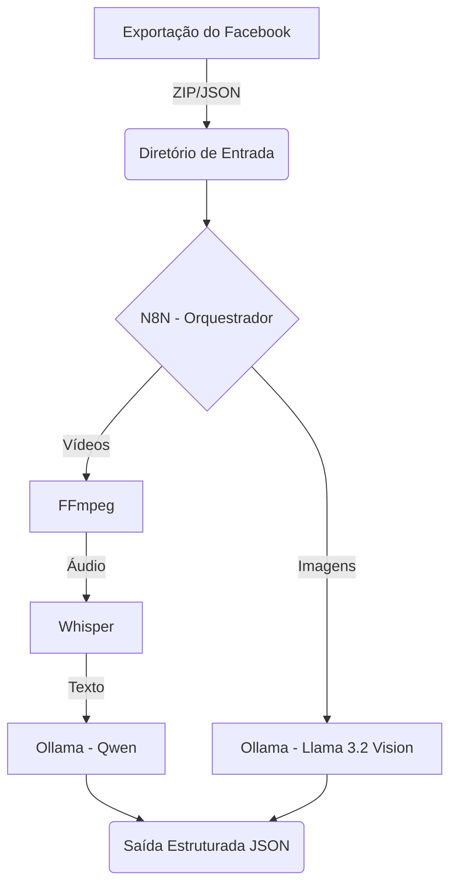

# 🧠 PipelineFace — Extração de Conhecimento de Perfil Facebook

Pipeline local para extrair conhecimento estruturado (transcrições, análise visual) a partir de vídeos e imagens de perfis do Facebook, usando N8N, Podman e modelos de IA locais. Todo o processamento é feito localmente, garantindo a privacidade dos seus dados.

---

## 📋 Visão Geral

O PipelineFace automatiza a extração de informações úteis a partir de um arquivo de exportação de dados do Facebook. Ele processa vídeos (transcrevendo o áudio) e imagens (analisando o conteúdo visual), extraindo fatos, entidades e tópicos usando modelos de IA avançados executados na sua própria máquina.

### Arquitetura do Sistema



### Tecnologias Principais
* **N8N**: Automação e orquestração do fluxo de trabalho.
* **Podman / Podman-Compose**: Gerenciamento dos containers.
* **Ollama**: Execução dos LLMs locais (`llama3.2-vision` e `qwen3` ou similiares).
* **Whisper (OpenAI)**: Transcrição de áudio.
* **FFmpeg**: Extração de áudio dos vídeos.
* **PostgreSQL**: Banco de dados para o N8N.

---

## 🔧 Pré-requisitos

* **Podman** (versão 4.0 ou superior)
* **podman-compose**
* **Hardware**:
  * **RAM**: 16 GB (mínimo), 32 GB (recomendado)
  * **Disco**: ~20 GB de espaço livre (principalmente para os modelos de IA)
  * **GPU**: Placa de vídeo NVIDIA (opcional, mas altamente recomendada para melhor performance).

### Instalação do Podman

**Ubuntu / Debian:**
```bash
sudo apt update
sudo apt install -y podman podman-compose
```

**Fedora / RHEL / CentOS:**
```bash
sudo dnf install -y podman podman-compose
```

---

## 🚀 Instalação e Setup

1. **Clone o repositório:**
   ```bash
   git clone https://github.com/seu-usuario/PipelineFace.git
   cd PipelineFace
   ```

2. **Execute o script de configuração inicial:**
   Este script criará os diretórios necessários, baixará os modelos de IA do Ollama e preparará o ambiente.
   ```bash
   ./scripts/setup.sh
   ```

3. **Aguarde os downloads:**
   O processo pode demorar dependendo da sua velocidade de internet, pois modelos de IA pesam alguns gigabytes.

4. **Acesse o N8N:**
   Abra o seu navegador e acesse: [http://localhost:5678](http://localhost:5678)

---

## 📥 Importando Dados do Facebook

1. **Solicite a exportação:**
   Vá no Facebook em: **Configurações → Central de Contas → Baixar suas informações**.
2. **Configure o formato:**
   * Selecione **Fotos/Vídeos** e **Publicações**.
   * Formato: **JSON**.
   * Qualidade de mídia: **Alta**.
3. **Importe para o pipeline:**
   Após baixar o arquivo `.zip` fornecido pelo Facebook, utilize o script de importação:
   ```bash
   ./scripts/import-facebook-data.sh /caminho/para/seu/arquivo-facebook.zip
   ```
   *Alternativa manual:* Extraia o arquivo e copie os vídeos para `data/input/videos/` e as imagens para `data/input/images/`.

---

## ⚙️ Como Funciona o Pipeline

O workflow do N8N opera nas seguintes etapas:

1. **Detecção:** O N8N monitora os diretórios de entrada aguardando novos arquivos (imagens ou vídeos).
2. **Processamento de Vídeo:**
   * O **FFmpeg** extrai a faixa de áudio do arquivo MP4.
   * O **Whisper** converte o áudio em texto (transcrição).
   * O modelo **Ollama** estrutura o texto extraindo entidades e fatos relevantes.
3. **Processamento de Imagem:**
   * O **Ollama Vision** (`llama3.2-vision`) analisa a imagem e gera uma descrição textual do que está acontecendo.
   * O modelo de texto estrutura essa descrição em entidades e fatos.
4. **Saída:** O resultado final é salvo como um arquivo `.json` estruturado no diretório `data/output/`.

---

## 📊 Formato de Saída

O pipeline gera arquivos JSON com o seguinte padrão:

```json
{
  "source": {
    "filename": "video_12345.mp4",
    "type": "video",
    "date_processed": "2026-07-24T10:30:00Z"
  },
  "transcription": "Olá pessoal, hoje estou aqui em São Paulo...",
  "visual_description": null,
  "extracted_knowledge": {
    "entities": ["São Paulo", "Pessoa"],
    "topics": ["Viagem", "Vlog"],
    "facts": [
      "O autor está em São Paulo.",
      "O autor está gravando um vídeo."
    ]
  }
}
```

---

## 🔍 Comandos Úteis

* `./scripts/setup.sh` - Instalação e configuração inicial (baixa modelos).
* `./scripts/check-status.sh` - Verifica o status dos containers em execução.
* `./scripts/import-facebook-data.sh <arquivo.zip>` - Importa os dados do Facebook.
* `podman-compose logs -f` - Visualiza os logs de todos os serviços em tempo real.
* `podman-compose down` - Para todos os serviços.
* `podman-compose up -d` - Inicia os serviços em segundo plano.

---

## 🐛 Resolução de Problemas

* **Erros de permissão com Podman Rootless:**
  Garanta que os diretórios mapeados em `./data` possuem permissão de escrita para o usuário que está rodando o Podman.
* **Falha no download dos modelos do Ollama:**
  Verifique sua conexão com a internet e espaço em disco. Execute `podman exec -it ollama ollama pull llama3.2-vision` manualmente para ver erros detalhados.
* **Whisper sem memória (Out of Memory / OOM):**
  Se o seu computador tiver pouca memória RAM, considere fechar outros aplicativos ou usar um modelo menor do Whisper modificando a configuração no N8N.
* **N8N não consegue conectar aos serviços:**
  Verifique se todos os containers subiram corretamente usando `podman-compose ps`. Certifique-se de usar os nomes dos hosts corretos (ex: `http://ollama:11434`) dentro do N8N, e não `localhost`.
* **Como verificar os logs detalhados:**
  Use `podman logs <nome_do_container>`.

---

## 📝 Notas

* **Estimativas de Tempo de Processamento:**
  * **Com GPU:** O processamento é muito mais rápido (segundos/minutos por arquivo).
  * **Com CPU:**
    * *Whisper (Modelo Base)*: Cerca de 1 minuto de processamento para cada 1 minuto de áudio.
    * *Ollama Vision*: 30 a 60 segundos por imagem dependendo do processador.
  * Para centenas de vídeos/imagens apenas em CPU, o processamento total pode levar entre **10 e 30 horas**. Recomendamos deixar rodando durante a noite.
* **Considerações Legais:** Você só deve processar dados e mídias exportados das suas próprias contas do Facebook ou de contas sobre as quais você tem consentimento explícito.

---

## 📁 Estrutura do Projeto

```text
PipelineFace/
├── data/
│   ├── input/
│   │   ├── images/
│   │   └── videos/
│   ├── output/
│   └── postgres/
├── scripts/
│   ├── setup.sh
│   ├── check-status.sh
│   └── import-facebook-data.sh
├── docker-compose.yml (ou podman-compose.yml)
└── README.md
```
